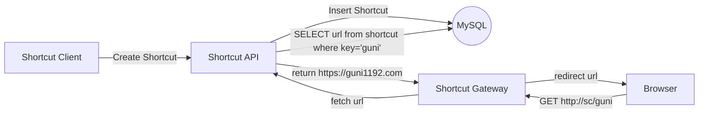
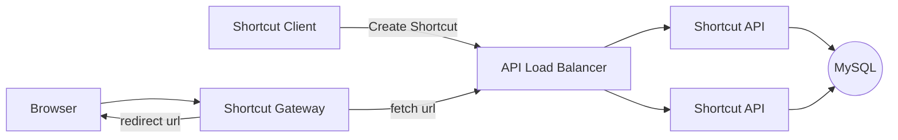

# Basic Architecture

* `Shortcut API` (`shortcut-api`) is gRPC server. It CRUD short URL from name.
* `Shortcut Gateway` (`shortcut-gateway`) is redirect to URL from name
* `Shortcut Client` (`sc`) is gRPC client cli.

## Shortcut API

## Shortcut Gateway

## Shortcut Client

## Improvement

* Shortcut Gateway cache mechanism for reducing latency.

## HA Stack

